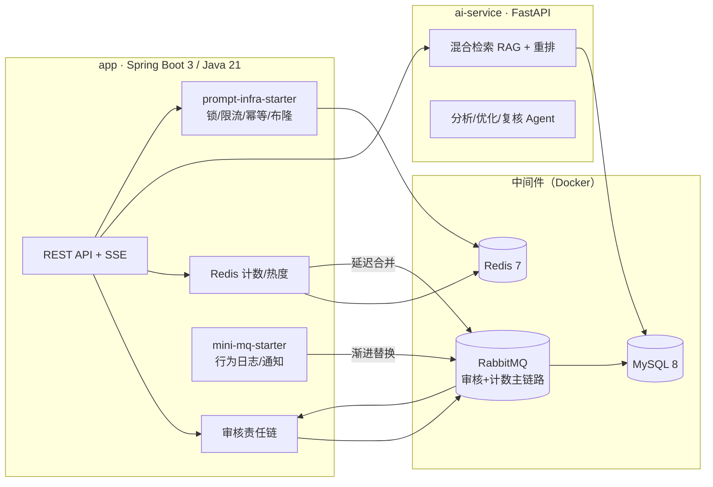

# AI Prompt System

一个 Prompt 管理与 AI 优化平台的后端系统：`Spring Boot 3 + Java 21` 主服务 + `FastAPI` AI 服务，覆盖 Prompt 的创建、审核、互动计数、热度排行与 AI 分析优化工作流，并沉淀了一套可复用的基础设施组件。

## 项目面向谁

- **学习后端工程化的开发者**：在一个真实业务闭环里看到鉴权、事务、缓存、消息队列、限流、可观测等能力的落地方式与取舍；
- **对 AI 应用感兴趣的同学**：了解「LLM 调用 + RAG 检索 + 工作流编排」如何与业务系统结合；
- **想练手中间件/组件开发的人**：仓库内的 mini-mq 与 starter 模块是完整的最小实现，可直接阅读、改造、对比。

## 项目包含什么

### 业务能力

- 用户注册、登录、JWT 鉴权、个人资料维护
- Prompt 创建（先审核后发布）、更新（版本号防并发覆盖）、删除、详情、分页检索（全文/分类/标签）
- 点赞、收藏、复制、浏览计数与各类热度排行榜
- 搜索历史与热门搜索词
- 发布审核链：敏感词 / 质量 / 原创性（责任链模式，经 RabbitMQ 异步执行）
- AI 优化工作流：分析 → 优化 → 复核，支持 SSE 流式输出，优化结果可确认保存为正式 Prompt
- RAG 问答：混合检索（稠密 + 关键词 + RRF 融合 + 重排）与带引用生成

### 基础设施与自研组件

- `prompt-infra-spring-boot-starter`：可重入分布式锁、滑动窗口限流、幂等注解、布隆过滤器（Redis + Lua 实现）
- `mini-mq`：自研消息中间件核心（分段 append-only 存储、消费组游标、ack/重试/死信、延迟消息、Netty 私有协议）
- `mini-mq-spring-boot-starter`：mini-mq 的 Spring Boot 自动装配（模板、`@MiniMqListener` 注解、健康检查）
- 可观测：OpenTelemetry 链路追踪 + Prometheus 指标 + Grafana 面板
- 压测与基准：JMH 基准模块与压测脚本，实验记录见 `docs/benchmarks/`

## 架构



### 模块划分

| 模块 | 职责 |
|---|---|
| `app/` | 主服务：用户/JWT、Prompt 业务、审核责任链、Redis 计数与热度、AI 优化工作流（经 Python 网关）、SSE 流式 |
| `ai-service/` | AI 服务（FastAPI）：混合检索 RAG、分析/优化/复核 Agent、流式输出 |
| `infra-starter/` | 基础设施 Starter：分布式锁 / 滑动窗口限流 / 幂等 / 布隆过滤器 |
| `mini-mq/` | 自研消息中间件核心（存储、消费语义、Netty 网络层） |
| `mini-mq-spring-boot-starter/` | mini-mq 的 Spring Boot 自动装配 |
| `benchmarks/` | JMH 基准套件 |
| `docs/benchmarks/` | 基准报告与原始数据 |

### 关键设计

- **审核异步化**：创建/更新事务提交后投递 RabbitMQ，责任链消费审核，杜绝消息与数据状态不一致
- **计数合并写**：互动计数先落 Redis，经延迟队列合并回刷 MySQL，降低热点行写压力
- **缓存防护**：布隆过滤器防穿透、互斥重建防击穿、TTL jitter 防雪崩，热点详情另有本地一级缓存
- **幂等与并发控制**：confirm 保存幂等、更新版本号乐观锁、计数同步分布式锁串行化
- **渐进式消息改造**：行为日志/通知链路可通过开关在进程内与 mini-mq 间切换，RabbitMQ 主链路保持不变

## 技术栈

`Java 21` · `Spring Boot 3.5` · `Spring Security` · `MyBatis-Plus` · `MySQL 8` · `Redis 7` · `RabbitMQ` · `Netty` · `JMH` · `Python 3` · `FastAPI` · `LangChain` · `pgvector` · `Ollama`

## 快速开始

```bash
# 1. 基础设施（MySQL/Redis/RabbitMQ）
docker compose up -d mysql redis rabbitmq
# 2. 构建与测试
./mvnw clean test
# 3. 启动主服务
./mvnw -pl app -am spring-boot:run -Dspring-boot.run.profiles=dev
# 4. 启动 AI 服务（可选，依赖 Ollama 与 pgvector）
cd ai-service && .\.venv\Scripts\python.exe -m uvicorn app.main:app --port 8000
```

接口文档（Knife4j）：`http://localhost:8080/doc.html`

## 各模块测试

```bash
./mvnw -pl app -am test                          # 主服务
./mvnw -pl infra-starter test                    # 基础设施 Starter（需本机 Redis）
./mvnw -pl mini-mq test                          # 消息中间件核心
./mvnw -pl mini-mq-spring-boot-starter -am test  # mini-mq Starter
cd ai-service && .\.venv\Scripts\python.exe -m pytest tests -q
```
