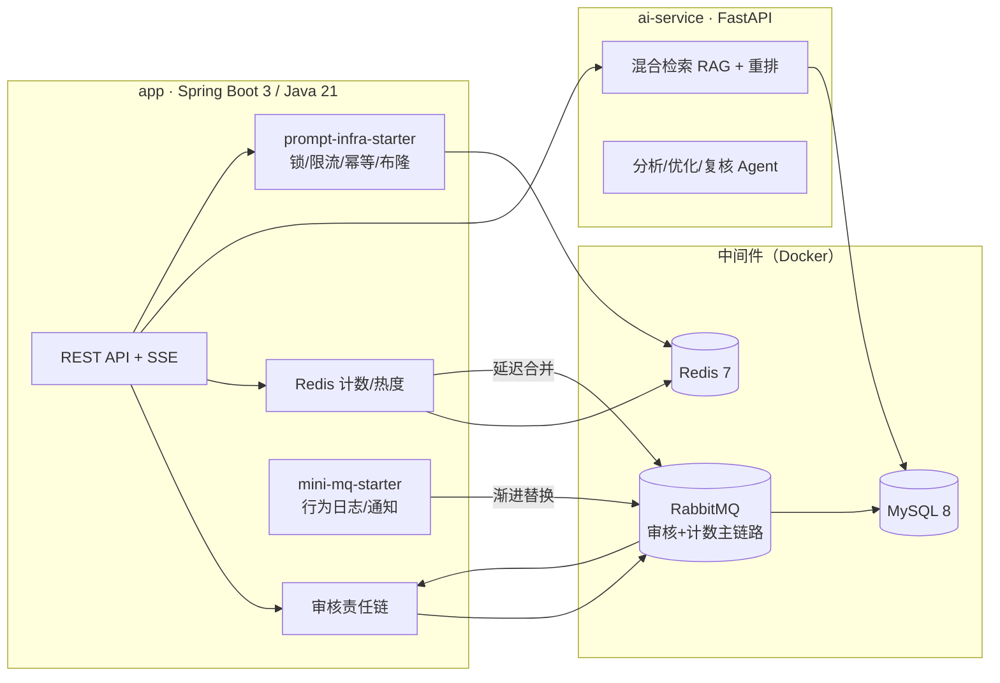

# AI Prompt System

一个工程化程度接近企业级的 **Prompt 管理与 AI 优化平台后端**：`Spring Boot 3 + Java 21` 主服务 + `FastAPI` AI 服务（RAG/优化/流式），含自研消息中间件与两个自研 Spring Boot Starter，全部核心路径有基准数据支撑。



## 仓库结构（Maven 多模块 + Python 服务）

| 模块 | 定位 |
|---|---|
| `app/` | 主服务：用户/JWT、Prompt CRUD 与版本控制、审核责任链、Redis 计数/热度、AI 优化工作流（经 Python 网关）、SSE 流式 |
| `ai-service/` | AI 服务（FastAPI）：混合检索 RAG（dense+keyword+RRF+重排）、分析/优化/复核 Agent、流式输出、评测服务 |
| `infra-starter/` | **自研基础设施 Starter**：可重入分布式锁 / 滑动窗口限流 / 幂等 / 布隆过滤器（Redis+Lua，主项目 dogfooding） |
| `mini-mq/` | **自研消息中间件核心**：分段 append-only 存储、消费组游标、ack/重试/死信、延迟消息、Netty 私有协议 |
| `mini-mq-spring-boot-starter/` | **自研 mini-mq 的 Starter**：MiniMqTemplate + @MiniMqListener + 健康检查 |
| `benchmarks/` | JMH 微基准套件（全部性能数据可一键复现） |
| `docs/benchmarks/` | 基准报告与原始数据 |

## 简历亮点清单（STAR：问题 → 方案 → 数据）

### 1. 互动计数链路：Redis 异步合并，直写 DB 的 ~5 倍吞吐
- **S（问题）**：点赞/收藏/浏览/复制是高频写；直写 DB 单行 UPDATE 实测仅 **180.6 ops/s**（JMH），且热点行行锁冲突。
- **T（方案）**：计数先写 Redis（INCR/ZINCRBY），脏集标记 + RabbitMQ 延迟队列合并回刷（dispatchKey 防重 + Lua 快照扣减 + 分布式锁串行化），TTL 加 jitter 防雪崩。
- **A（数据）**：Redis INCR **914.4 ops/s（≈5.1×）**；全链路 A/B（20/50 并发）redis-mq 模式 TPS 显著优于 direct-db 且 DB 写入次数大幅下降（原始数据 `docs/benchmarks/raw/ab_*.json`）。

### 2. 自研分布式锁（infra-starter）：20 线程竞争恰好互斥
- **S**：计数同步、缓存重建等路径原用 setIfAbsent+uuid，无重入、无续期，长任务锁过期即并发。
- **T**：Hash+计数可重入（HINCRBY）、Lua 释放校验 token 防误删、WatchDog 以 lease/3 间隔续租、Micrometer 指标。
- **A**：集成测试 20 线程持锁竞争全部失败（互斥）；WatchDog 实测 300ms 租约存活超 1s；JMH 无竞争 361 对/s、4 线程竞争组 2167/s。

### 3. 限流升级：滑动窗口替代固定窗口，-20% 吞吐换窗口精确
- **S**：固定窗口 INCR+EXPIRE 在窗口边界可被 2× 突刺穿过。
- **T**：`@RateLimit` 注解 + ZSET 滑动窗口单条 Lua 原子判定（ZREMRANGEBYSCORE+ZCARD+ZADD），维度支持 IP/用户/SpEL；Redis 故障 fail-open。
- **A**：JMH 滑动窗口 **728.5 vs 固定 914.4 ops/s（-20%）**；50 并发突刺测试恰好放行 limit 个（Lua 原子性验证）。登录/搜索限流已切换，复制接口新增注解限流。

### 4. 缓存三防：布隆 + 互斥重建 + 空值/jitter
- **S**：查询不存在的 ID 每次落 DB；热点详情缓存失效瞬间并发击穿。
- **T**：自研 Redis bitmap 布隆（m/k 按 n 与误判率推导，双哈希派生，pipeline k 次位操作合并 1 RTT）+ 预热（防冷启动误 404）+ 互斥重建单飞 + 空值缓存。
- **A**：预热实测 **1500 prompts / 3.9s / 位图 117KB**；布隆实测误判率 ≤ 理论值 2 倍裕量（10k 采样）；JMH add/mightContain ~750 ops/s；切片测试验证不存在 ID 零 DB 命中。

### 5. 自研消息中间件 mini-mq（14 项测试全绿）
- **S**：业务侧行为日志/通知与主链路耦合在进程内 @Async，无法独立演进；RabbitMQ 主链路不宜频繁变更。
- **T**：从零实现存储引擎（分段 append-only + 长度前缀 + 启动恢复 + 尾部损坏截断）、消费语义（组游标/ack/nack/重试 3 次转死信/延迟消息 50ms 调度）、Netty 私有协议（半包粘包重组、requestId 并发匹配）。
- **A**：**「确认」路径发布吞吐 1340.5 ops/s，高于同机 RabbitMQ publisher-confirm（734.0 ops/s，1.83×），且 mini-mq 为每消息 fsync 而 RabbitMQ confirm 不刷盘；fire-and-forget 差距 13.6× 已定位为刷盘策略差异（批量组提交为已标注的优化项）。详见 `docs/benchmarks/mq-comparison.md`。

### 6. 两个自研 Spring Boot Starter，主项目 dogfooding
- **S**：横切能力（锁/限流/幂等/布隆）散落业务代码；mini-mq 客户端使用门槛高。
- **T**：`prompt-infra-spring-boot-starter`（AutoConfiguration + 属性 + SPI 设计：IP/用户维度经 RequestDimension 解耦，不依赖 servlet/security）；`mini-mq-spring-boot-starter`（Template + @MiniMqListener 容器 + 健康检查，默认关闭的渐进替换开关）。
- **A**：主项目接入成本 = 一个依赖 + 零 Java 配置；行为日志/通知链路经 `prompt.mq.mode` 一键在本地/mini-MQ 间切换，broker 故障自动回退本地（单测覆盖）；starter 端到端测试全绿。

### 7. RAG 检索质量：三通道矩阵 + 审计修正
- **S**：关键词通道 websearch_to_tsquery 为 AND 语义，79/79 查询恒为空，hybrid ≈ dense。
- **T**：修正为词元 OR 语义 → 审计发现裸 OR 注入噪声（hybrid 0.500 vs dense 0.5738，**负结果如实记录**）→ 升级为 IDF 过滤低区分度词（ts_stat 语料统计 + ndoc≥60% 截断 + 最多 6 词）。
- **A**：dense 基线 R@5=0.5738 / MRR@5=0.4211；+BGE 重排 R@5=0.6413（+11.8%，代价 CPU 重排延迟高）；EXACT vs HNSW 质量持平、P95 19.9ms vs 20.0ms；IDF 版结果见 `docs/benchmarks/rag-keyword-idf.md`。RAG 压测饱和点 ~69 TPS，瓶颈在本地嵌入推理（`docs/benchmarks/raw/p4_*.json`）。

### 8. 企业级工程底座
- 多模块 Maven + Docker Compose 全家桶 + OTel/Prometheus/Grafana/Tempo 可观测 + 统一异常/参数校验 + JWT 无状态认证 + 版本号乐观锁 + 幂等 confirm + 行为日志/通知异步解耦。

## 基准数据速查

| 实验 | 关键数字 | 报告 |
|---|---|---|
| JMH 微基准（9 项） | Redis INCR 914 vs MySQL UPDATE 181；滑动窗口 -20%；布隆 ~750 | `docs/benchmarks/jmh-report.md` |
| mini-MQ vs RabbitMQ | confirms 路径 1.83×；fire-and-forget 13.6×（fsync 差异） | `docs/benchmarks/mq-comparison.md` |
| 计数 A/B 全链路 | 20/50 并发 redis-mq vs direct-db | `docs/benchmarks/report-2026-08-rag-counting.md` |
| RAG 检索矩阵 | dense R@5=0.5738；+rerank 0.6413；chunk 消融 256→1600 | 同上 + `rag-keyword-idf.md` |
| RAG 压测 | TPS 饱和 ~69（嵌入瓶颈） | `docs/benchmarks/raw/p4_*.json` |

所有数据可复现：JMH 命令见各报告；原始 JSON/CSV 在 `docs/benchmarks/raw/`。

## 本地运行

```bash
# 1. 基础设施（MySQL/Redis/RabbitMQ/OTel/Prometheus/Grafana/Tempo）
docker compose up -d mysql redis rabbitmq
# 2. 全量构建（聚合多模块）
./mvnw clean test
# 3. 启动主服务（dev：MySQL root/123456@ai_prompt、RabbitMQ admin/123456、Redis 6379）
./mvnw -pl app -am spring-boot:run -Dspring-boot.run.profiles=dev
# 4. AI 服务（Ollama + pgvector，可选）
cd ai-service && .\.venv\Scripts\python.exe -m uvicorn app.main:app --port 8000
```

接口文档：`http://localhost:8080/doc.html`（Knife4j）。

## 测试矩阵

| 模块 | 测试 | 状态 |
|---|---|---|
| app | 18 测试类（含缓存三防切片、MQ 降级、AI 网关） | `./mvnw -pl app -am test` 全绿 |
| infra-starter | 20 个集成测试打真实 Redis（锁 7/限流 4/幂等 3/布隆 6） | 全绿 |
| mini-mq | 14（存储 6/语义 7/端到端 1） | 全绿 |
| mini-mq-spring-boot-starter | 1 端到端（真 broker 发布→@MiniMqListener 消费） | 全绿 |
| ai-service | pytest 126+ | 全绿 |

## 诚实边界

- mini-mq 为学习型单机中间件：无分区/副本/集群/共识，README 明示，不以替代 RabbitMQ 为卖点。
- 基准为单机 loopback 数据，用于相对比较，不作容量承诺；误差区间见原始 JSON。
- RAG 重排为 CPU 推理，延迟高（中位 ~13.8s），已在报告中标注为取舍。
